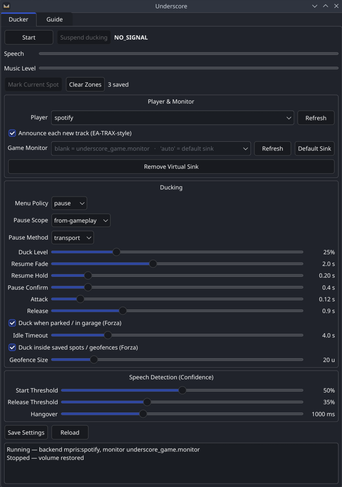

<div align="center">
  
## This is a primairly AI-created program.
### If that's not your speed, no worries. Just warning you before you get too far into it
</div>
<br/>
<br/>
<br/>


<p align="center">
  
</p>

# Underscore

**Underscore is an audio-side dialogue ducker for gaming on Linux.** Underscore turns your
music down when someone game starts talking, then brings it back up when
they stop - so story dialogue doesn't get buried under Spotify, and you don't have
to ride the volume knob yourself.

It decides when dialogue is happening by *listening to the game's audio*. Everything runs locally; nothing is sent anywhere.

Originally designed for the later Forza Horizon games (4/5/6) and BeamNG.Drive, its speech detection model is game agnostic and can be ran on basically any media stream.


<p align="center">
  
</p>


## How it works

Underscore captures your specified audio stream from a PipeWire monitor and runs it through
the [Silero VAD](https://github.com/snakers4/silero-vad) model to detect speech. When speech starts it fades your music down; when it
stops it fades back up. Music volume and play/pause are driven over MPRIS through
D-Bus (so any standard player works - Spotify, mpv, etc.), with `playerctl` and
`pactl` as fallbacks.

Underscore also uses Forza Horizon's Data Out feature to implement feature that make it closer to a full music replacement/*Radio station* than a simple dialogue detecter, such as:
- Muting (or pausing) your music when you pause the game
- Ducking the music when in a garage (see *Ducking while parked (garage & saved spots)*)
- Ducking when idle in game (see *Ducking while parked (garage & saved spots)*)
- The ability to manually save coordinates for ducking
- EA TRAX Style music notificaions using `notify-send`

Like mentioned earlier, the VAD is not tied to any telemetry data, or to games at all - it just listens
to an audio stream and ducks on voice. The Forza (and BeamNG) telemetry only powers
the *state-aware* extras. For anything else - a different game, a Twitch stream, a YouTube video, a film in
the background - run **`--game generic`** (or pick **Generic** in the GUI) and
Underscore ducks your music whenever it hears speech, with no telemetry involved.


## Requirements

- Linux with **PipeWire** + **WirePlumber** (standard on modern most modern Linux installs)
- **Python 3** (the installer sets up the rest in a private virtualenv)
- An MPRIS-capable music player (Spotify, mpv, …)

The Python libraries (`onnxruntime`, `numpy`, `jeepney`, `PySide6`) are installed
for you - into a venv by `install.sh`, or as system packages by the PKGBUILD.

---

## Installation

### Arch Linux (PKGBUILD)

From the repo root:

```bash
makepkg -si
```

This installs `underscore` and `underscore-gui` to `/usr/bin`, pulls dependencies
through pacman, and registers the app menu entry and icon.

### Any other distro (`install.sh`)

```bash
git clone https://github.com/c1hucktay4lors/Underscore.git
cd Underscore
./install.sh
```

The installer:

1. Detects your package manager (pacman / apt / dnf / zypper) and **asks before
   installing** the system packages it needs (PipeWire tools, WirePlumber,
   libnotify, and Python + venv if missing).
2. Builds a private virtualenv and pip-installs the Python libraries.
3. Installs Underscore under `~/.local/share/underscore` and drops `underscore`
   and `underscore-gui` wrappers in `~/.local/bin`, so the commands work from
   anywhere - no shell alias needed. It also registers the app-menu entry + icon.

If `~/.local/bin` isn't on your `PATH`, the installer tells you the line to add to
`~/.profile`.

To remove everything (your config is left in place):

```bash
./install.sh uninstall
```

> The PKGBUILD and the script install the **same program** - they only differ in
> where things land (system vs. `~/.local`) and how dependencies are provided.

---

## Usage

### GUI

```bash
underscore-gui
```

Also appears in your application menu as **Underscore**. Pick your player and
capture source, hit **Start**, and watch the speech/volume meters. There's a
**Suspend ducking** button and a system-tray entry.

### CLI

```bash
underscore run                 # start ducking
underscore players             # list MPRIS players (find your --player)
underscore sources             # list capture targets (find --game-monitor)
underscore setup               # create an isolated virtual sink for the game
underscore teardown            # remove it
underscore diag                # environment sanity check
```

### Isolating the game audio (recommended)

Capturing your default output works, but it also hears your music, which can
false-trigger on vocals. To feed Underscore *only* the game:

1. `underscore setup` - creates an **Underscore_Game** virtual sink.
2. Route the game's audio into it: 
- **KDE**: use the audio applet's per-app output.
- **All other DEs/WMs**: install `pavucontrol` *(Most can't route per-app, if they can without this let me know!)*
3.  Then in its
   **Playback** tab, set the game's output device to **Underscore_Game**.
4. Capture `underscore_game.monitor` (the default after `setup`).

Now your music plays to your real speakers untouched while Underscore listens to
the game alone.

---

## Suspending ducking on the fly

Sometimes you just want the music at full volume - a favorite track or a quiet
stretch. The override toggle holds the music up and ignores speech until you turn
it back off.

- **GUI:** the **Suspend ducking** button, or the tray entry.
- **Anywhere:** `underscore toggle` flips it on a running instance.

For a real "hit a key mid-race" override, bind a keyboard shortcut to that command.
On KDE/GNOME: **Settings → Keyboard → Shortcuts → add a custom command** set to
`underscore toggle`. You'll get a desktop notification confirming each toggle.

> Why a command instead of Underscore grabbing the key itself? On Wayland, apps
> can't capture global hotkeys by design - the compositor owns them. So the desktop
> owns the key and `underscore toggle` just signals the running process, which works
> on both Wayland and X11.

---

## Ducking while parked (garage & saved spots)

Forza keeps streaming telemetry even while you sit in the garage, so Underscore
can lower the music when you're parked - handy for hearing engine-sound previews
or just browsing menus. Two mechanisms, usable together or separately (Forza only;
both read the car's telemetry):

**Idle-duck** ducks whenever the car is stationary for a few seconds, *anywhere*.
Turn on **Duck when idle** in the GUI, or `--idle-duck`. Tune how
long it waits with `--idle-grace` (default 4 s) and what counts as stopped with
`--idle-speed` (default 1.0 m/s). Simple, but it also dips the music if you stop
at a light on the open road.

**Geofence duck-zones** duck *only* at locations you've saved, so a road stop is
left alone. Sit in a garage and record the spot, then enable the zones:

- **GUI:** **Mark Current Spot** (in the header, live while running), and the
  **Duck inside saved spots** checkbox. **Clear Zones** wipes them.
- **CLI:** `underscore mark` records the current spot in a running instance;
  `underscore mark --clear` removes all; run with `--geofence-duck`.

A spot is a small box (default ±20 units on each axis, `--geofence-radius`) around
the recorded coordinate. It's intentionally tight: once you take control of the car
its position moves outside the box, so the music comes straight back up. You also
have to **dwell** inside the box for `--geofence-enter-grace` (default 1 s) before it
ducks, so merely driving *through* a marked spot does nothing - only parking there
triggers it.

**Zones are tagged by game.** Forza Horizon 4, 5 and 6 send byte-identical telemetry
but are different maps, so a coordinate saved in one is meaningless (and a possible
false trigger) in another. Each zone is therefore stamped with the title it was
marked in, and only zones matching the running title apply. Because the titles can't
be told apart from the packet, you name yours explicitly - `--game fh6` (or `fh5` /
`fh4`), or the **Game** dropdown in the GUI - and mark your garages under it. Run with
that title and only its zones are live. (Older zones saved before tagging are
untagged and apply to any Forza title; re-mark them under a title to pin them down.)

Inside a saved zone, **ducking takes priority over the pause policy**: a car swap
briefly zeroes the telemetry, but Underscore stays "in" the zone and keeps the music
ducked instead of pausing - so there's no pause/resume cycle and no resume blip while
you change cars. If a pause lasts longer than `--geofence-pause-grace` (default 8 s),
Underscore assumes you've left for a menu and normal pause behavior resumes.

---

## Now Playing notifications (EA TRAX style)

Turn on **Announce each new track** in the GUI (or pass `--now-playing`) and
Underscore pops a desktop notification - *♪ Now Playing · Artist - Title* - each
time your music moves to a new song, the way the old EA Sports games flashed the
track up on screen. It reads the track straight from the player's MPRIS metadata,
polls about once a second, and de-dupes so each song announces only once. Works
in both Forza and BeamNG modes (it's about the music, not the game), with any
player that exposes metadata over MPRIS or `playerctl`.

---

## Configuration

Settings are saved to `~/.config/underscore/config.toml` and can be overridden per
run with CLI flags. To get a fully-populated file of defaults to edit by hand, run
`underscore init-config` (it won't overwrite an existing one without `--force`); a
default config is also created automatically the first time you `run` **or launch
the GUI**. Use a different location with the global `--config PATH` flag (e.g.
`underscore --config ./my.toml run`).

| Flag | Purpose |
|------|---------|
| `--player NAME` | MPRIS player to control (default `spotify`) |
| `--now-playing` | Desktop notification of artist/title on each new track |
| `--game-monitor NAME` | PipeWire monitor to capture |
| `--volume-backend {auto,mpris,playerctl,pactl}` | How to control volume (default `auto`) |
| `--menu-policy {speech,always,never,pause}` | Behavior in menus (default `speech`) |
| `--pause-method {mute,pause}` | `pause` policy: `mute` = volume-only, no resume blip (track runs on); `pause` = real Pause/Play (track freezes) |
| `--idle-duck` · `--idle-grace S` · `--idle-speed M` | Duck when parked anywhere (see above) |
| `--geofence-duck` · `--geofence-radius U` · `--geofence-enter-grace S` · `--geofence-pause-grace S` | Duck only inside saved spots (see above) |
| `--game {auto,fh4,fh5,fh6,forza,generic,beamng}` | Game/title. Auto-detects BeamNG vs Forza; a Horizon title keeps its garage zones separate; `generic` = VAD-only ducking for any game or media (no telemetry) |
| `--verbose` | Debug logging |
| `--version` | Print version |

Run `underscore run --help` for the full list (thresholds, fades, ports, offsets).

---

## Troubleshooting

- **`underscore sources` is empty or errors** - install the PipeWire/WirePlumber
  CLI tools (`pw-record`, `wpctl`). On Ubuntu: `sudo apt install pipewire-bin wireplumber`.
- **The virtual sink doesn't appear after creating the Virtual Sink (either in GUI or by runnng ```setup```** - restart the audio stack:
  `systemctl --user restart pipewire pipewire-pulse wireplumber` (note
  `pipewire-pulse` on distros that ship it, like Ubuntu), or log out and back in.
- **Icon does not appear correctly** - make sure Underscore is *installed*
  (not run loose from a folder) so the `.desktop` entry and icon are registered,
  then log out/in once so the desktop re-reads them. The tray icon is always correct.
- **`underscore toggle` works in a terminal but not from a keyboard shortcut** -
  the shortcut must run a real command, not a shell alias. The installer's
  `~/.local/bin/underscore` wrapper handles this; point the shortcut at
  `underscore toggle` (or the absolute path to the wrapper).
- **The GUI does not open after installation** - On some distros (*tested on OpenSUSE Tumbleweed XFCE and Linux Mint MATE*) the GUI won't open from from the Application menu and if you run ```underscore-gui``` in a terminal you get the following error:

  ```qt.qpa.plugin: From 6.5.0, xcb-cursor0 or libxcb-cursor0 is needed to load the Qt xcb platform plugin.```

  Install ```xcb-cursor0``` or ```libxcb-cursor0``` from your package manager (```libxcb-cursor0``` is tested to work)

---

## Credits & License

Created by **c1hucktay4lors** with the use of AI (mainly Claude).
Speech detection uses the [Silero VAD](https://github.com/snakers4/silero-vad)
model (MIT). Licensed under the **MIT License** - see [LICENSE](LICENSE).
